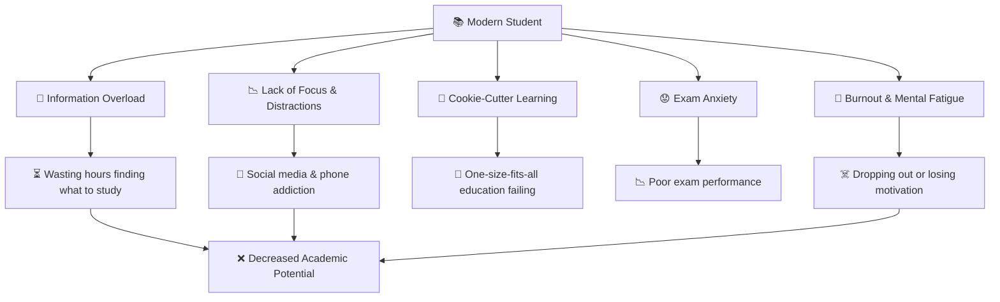
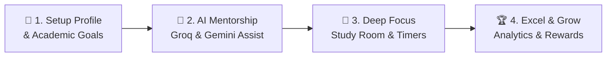
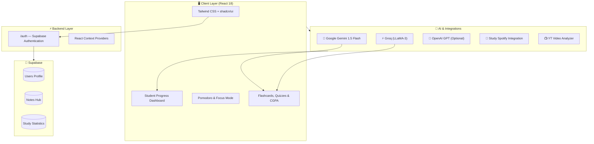
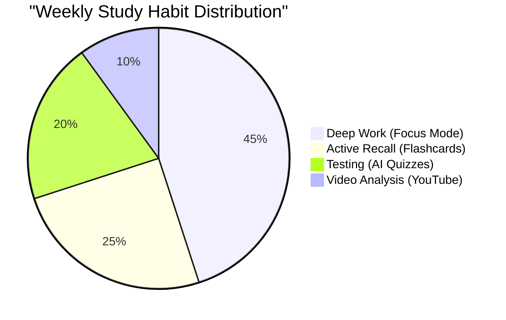
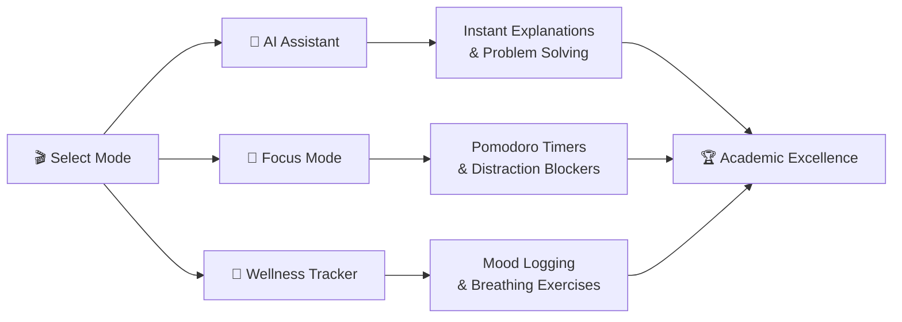

<div align="center">
<a href="https://github.com/Snehasish-tech/ChhatroBondhu-2.0">
  
  
</a>
</div>
<h3 align="center"><i>"Transforming your study experience with our comprehensive suite of AI-powered tools designed for academic excellence."</i></h3>

<p align="center">
  <a href="#"></a>
  <a href="https://reactjs.org/"></a>
  <a href="https://supabase.com/"></a><br/>
  <a href="https://groq.com/"></a>
  <a href="https://deepmind.google/technologies/gemini/"></a>
  <a href="https://tailwindcss.com"></a>
</p>

<div align="center">
  
</div>

<br/>

# 🎯 The Problem

**Students today are overwhelmed with distractions, information overload, and a lack of personalized guidance.**



## 💡 Our Solution

**ChhatroBondhu 2.0** is an all-in-one AI-powered study ecosystem — transforming chaos into hyper-focused, personalized, and gamified learning experiences. 

> *"Learn smarter, not harder. With the right AI companion, every student has the potential to become a top performer."*

### 🎬 How It Works



# ️ System Architecture

### High-Level Overview



# 🔍 Learning Intelligence Dashboard

The **ChhatroBondhu Dashboard** acts as your central command center, interrogating your study habits in real-time to recommend actions, track streaks, and maintain mental wellness.

## 📊 Academic Analytics

### 🎯 Student Focus Distribution



### 🎭 Learning Intelligence Modes



# 🔧 Tech Stack

<div align="center">

| Category | Technologies |
|:--------:|:------------:|
| **Frontend** |    |
| **UI Components** |   |
| **Database & Auth** |  |
| **AI Models** |   |
| **Data Visualization** |  |
| **Deployment** |  |

</div>

# ✨ 17+ Smart Features

<div align="center">

| Feature | Description |
|:------:|:-----------:|
| 🧠 **AI Study Assistant** | Instant answers and personalized recommendations (Groq/Gemini). |
| 🎯 **Smart Focus Mode** | Pomodoro timers, distraction blocking & ambient sounds. |
| 🎙️ **Voice Notes & Audio** | Record lectures, convert speech to text, generate summaries. |
| 📺 **YouTube Integration** | Extract key points from educational videos automatically. |
| 📝 **Smart Flashcards** | AI-generated flashcards utilizing spaced repetition. |
| ✍️ **Handwriting to Digital** | Convert physical handwritten notes to digital text. |
| 📊 **Exam Pattern Analyzer** | Analyze past papers and predict likely exam questions. |
| 🧘 **Mental Health Tracker** | Track mood, stress levels, and practice breathing exercises. |
| 🏆 **Challenge Mode** | Gamified learning: earn XP, rank on leaderboards, keep streaks. |
| 🎶 **Study Spotify** | Curated focus playlists that adapt to your study vibe. |
| 🗓️ **Smart Schedule** | AI-powered calendar optimizing your study sessions. |
| 🤝 **Notes Sharing Hub** | Collaborate and share your study materials with peers. |

</div>

# 🚀 Getting Started

> Spin up **ChhatroBondhu 2.0** locally in minutes.

## 🧰 Requirements

- **Node.js** ≥ 18 (LTS recommended)
- **Supabase** account (Free tier)
- **API Keys:** Groq or Google Gemini

## 📦 Project Setup

```bash
git clone https://github.com/Snehasish-tech/ChhatroBondhu-2.0.git
cd ChhatroBondhu-2.0
npm install
```

### 🔐 Environment Configuration

Create a `.env` file in the root directory:

```bash
# Supabase Configuration
VITE_SUPABASE_PROJECT_ID=your_supabase_project_id
VITE_SUPABASE_PUBLISHABLE_KEY=your_supabase_anon_key
VITE_SUPABASE_URL=https://your_project_id.supabase.co

# AI API Configuration
VITE_GROQ_API_KEY=your_groq_api_key_here
VITE_AI_PROVIDER=groq
```

### ▶️ Run the App

```bash
npm run dev
```
The app will be running at `http://localhost:5173`

# 🗺️ Roadmap

| Status | Feature | Impact |
|:------:|:-------:|:------:|
| ✅ | AI Chat Assistant (Groq/Gemini) | Instant academic problem solving |
| ✅ | Focus Mode & Distraction Blocker | +40% increase in deep work |
| ✅ | AI Flashcards & Quizzes | Better memory retention |
| ✅ | Dashboard & Analytics | Clear visibility of progress |
| ✅ | YouTube Video Analyzer | Save hours of video watching |
| 🔄 | 3D Interactive Visualizations | Immersive complex concept learning |
| 🔄 | 1-on-1 Mentorship matching | Connect students with experts |
| 🔄 | Mobile App / PWA | On-the-go study capabilities |

# 🤝 Contributing

We welcome contributions! Please see our CONTRIBUTING.md for details on how to get started, project setup, and coding guidelines.

---

<div align="center">

_**"🧠 Learning Intelligence Activated."**_ <br/>
**Built with ❤️ for Students Worldwide!**

[!Supabase](https://supabase.com/)
[!Vercel](https://vercel.com/)
[!Groq](https://groq.com/)
[!React](https://react.dev/)

</div>
