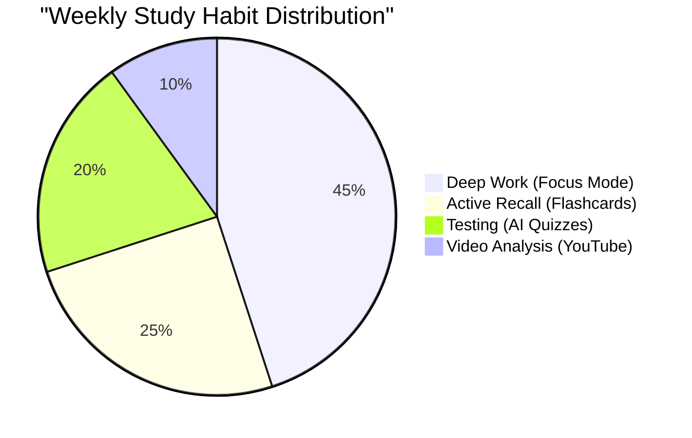

<div align="center">
<a href="https://github.com/Snehasish-tech/Unilife-2.0">
  
  
</a>
</div>
<h3 align="center"><i>"Transforming your study experience with our comprehensive suite of AI-powered tools designed for academic excellence."</i></h3>

<p align="center">
  <a href="https://groq.com/"></a>
  <a href="https://tailwindcss.com"></a>
</p>

<div align="center">
  
</div>

<br/>

# 🎯 The Problem

**Students today are overwhelmed with distractions, information overload, and a lack of personalized guidance.**

```mermaid
flowchart TB
    A[📚 Modern Student]
    B[🤯 Information Overload]
    C[📉 Lack of Focus & Distractions]
    D[🚫 Cookie-Cutter Learning]
    E[😟 Exam Anxiety]
    F[🥱 Burnout & Mental Fatigue]

    A --> B
    A --> C
    A --> D
    A --> E
    A --> F

    B --> B1[⏳ Wasting hours finding what to study]
    C --> C1[📱 Social media & phone addiction]
    D --> D1[🚫 One-size-fits-all education failing]
    E --> E1[📉 Poor exam performance]
    F --> F1[☠️ Dropping out or losing motivation]

    B1 --> X[❌ Decreased Academic Potential]
    C1 --> X
    F1 --> X
```



## 💡 Our Solution

**Unilife 2.0** is an all-in-one AI-powered study ecosystem — transforming chaos into hyper-focused, personalized, and gamified learning experiences. 

> *"Learn smarter, not harder. With the right AI companion, every student has the potential to become a top performer."*

### 🎬 How It Works

```mermaid
flowchart LR
    A[👤 1. Setup Profile<br/>& Academic Goals] --> B[🤖 2. AI Mentorship<br/>Groq & Gemini Assist]
    B --> C[🎯 3. Deep Focus<br/>Study Room & Timers]
    C --> D[🏆 4. Excel & Grow<br/>Analytics & Rewards]
```



# ️ System Architecture

### High-Level Overview

```mermaid
flowchart TB
    subgraph Client["🖥️ Client Layer (React 18)"]
        UI["Tailwind CSS + shadcn/ui"]
        Dashboard["Student Progress Dashboard"]
        StudyRoom["Pomodoro & Focus Mode"]
        Tools["Flashcards, Quizzes & CGPA"]
    end

    subgraph API["âš¡ Backend Layer"]
        Auth["/auth — Supabase Authentication"]
        Context["React Context Providers"]
    end

    subgraph Services["🤖 AI & Integrations"]
        Groq["âš¡ Groq (LLaMA-3)"]
        Gemini["🧠 Google Gemini 1.5 Flash"]
        OpenAI["💬 OpenAI GPT (Optional)"]
        Spotify["🎵 Study Spotify Integration"]
        YouTube["📺 YT Video Analyzer"]
    end

    subgraph Database["🐘 Supabase"]
        Users[("Users Profile")]
        Notes[("Notes Hub")]
        Stats[("Study Statistics")]
    end

    UI --> Auth
    Auth --> Database
    Client --> Services
    Groq --> Tools
    Gemini --> Tools
    Services --> Dashboard
```



# 🔍 Learning Intelligence Dashboard

The **Unilife Dashboard** acts as your central command center, interrogating your study habits in real-time to recommend actions, track streaks, and maintain mental wellness.

## 📊 Academic Analytics

### 🎯 Student Focus Distribution



### 🎭 Learning Intelligence Modes

```mermaid
graph LR
    A[🎬 Select Mode] --> B[🧠 AI Assistant]
    A --> C[🎯 Focus Mode]
    A --> D[🧘 Wellness Tracker]

    B --> E["Instant Explanations<br/>& Problem Solving"]
    C --> F["Pomodoro Timers<br/>& Distraction Blockers"]
    D --> G["Mood Logging<br/>& Breathing Exercises"]

    E --> H[🏆 Academic Excellence]
    F --> H
    G --> H
```



# 🔧 Tech Stack

<div align="center">

| Category | Technologies |
|:--------:|:------------:|
| **Frontend** |    |
| **UI Components** |   |
| **Database & Auth** |  |
| **AI Models** |   |
| **Data Visualization** |  |
| **Deployment** |  |

</div>

# ✨ 17+ Smart Features

<div align="center">

| Status | Feature | Description |
|:---:|:---:|:---|
| ✅ **Active** | 🎯 **Study Room** | Pomodoro timers, distraction blocking & ambient sounds. |
| ✅ **Active** | 🗓️ **Smart Schedule** | AI-powered calendar optimizing your study sessions. |
| ✅ **Active** | 🤝 **Notes Sharing Hub** | Collaborate and share your study materials with peers. |
| ✅ **Active** | 🔔 **Smart Reminders** | Set intelligent reminders for study sessions and tasks. |
| ✅ **Active** | 🧮 **CGPA Calculator** | Easily calculate and track your Grade Point Average. |
| 🚧 **Hidden** | 🧠 **AI Study Assistant** | Instant answers and personalized recommendations (Groq/Gemini). |
| 🚧 **Hidden** | 🎙️ **Voice Notes & Audio** | Record lectures, convert speech to text, generate summaries. |
| 🚧 **Hidden** | 📺 **YouTube Integration** | Extract key points from educational videos automatically. |
| 🚧 **Hidden** | 📝 **Smart Flashcards** | AI-generated flashcards utilizing spaced repetition. |
| 🚧 **Hidden** | ✍️ **Handwriting to Digital** | Convert physical handwritten notes to digital text. |
| 🚧 **Hidden** | 📊 **Exam Pattern Analyzer** | Analyze past papers and predict likely exam questions. |
| 🚧 **Hidden** | 🧘 **Mental Health Tracker** | Track mood, stress levels, and practice breathing exercises. |
| 🚧 **Hidden** | 🏆 **Challenge Mode** | Gamified learning: earn XP, rank on leaderboards, keep streaks. |
| 🚧 **Hidden** | 🎶 **Study Spotify** | Curated focus playlists that adapt to your study vibe. |

</div>

# 🚀 Getting Started

> Spin up **Unilife 2.0** locally in minutes.

## 🧰 Requirements

- **Node.js** ≥ 18 (LTS recommended)
- **Supabase** account (Free tier)
- **API Keys:** Groq or Google Gemini

## 📦 Project Setup

```bash
git clone https://github.com/Snehasish-tech/Unilife-2.0.git
cd Unilife-2.0
npm install
```

### 🔐 Environment Configuration

Create a `.env` file in the root directory:

```bash
# Supabase Configuration
VITE_SUPABASE_URL=your_supabase_url
VITE_SUPABASE_ANON_KEY=your_supabase_anon_key

# AI API Configuration
VITE_GROQ_API_KEY=your_groq_api_key_here
VITE_AI_PROVIDER=groq
```

### ▶️ Run the App

```bash
npm run dev
```
The app will be running at `http://localhost:5173`

# 🗺️ Roadmap

| Status | Feature | Impact |
|:------:|:-------:|:------:|
| ✅ | AI Chat Assistant (Groq/Gemini) | Instant academic problem solving |
| ✅ | Focus Mode & Distraction Blocker | +40% increase in deep work |
| ✅ | AI Flashcards & Quizzes | Better memory retention |
| ✅ | Dashboard & Analytics | Clear visibility of progress |
| ✅ | YouTube Video Analyzer | Save hours of video watching |
| 🔄 | 3D Interactive Visualizations | Immersive complex concept learning |
| 🔄 | 1-on-1 Mentorship matching | Connect students with experts |
| 🔄 | Mobile App / PWA | On-the-go study capabilities |

# 🤝 Contributing

We welcome contributions! Please see our CONTRIBUTING.md for details on how to get started, project setup, and coding guidelines.

---

<div align="center">

_**"🧠 Learning Intelligence Activated."**_ <br/>
**Built with ❤️ for Students Worldwide!**

[!Supabase](https://supabase.com/)
[!Vercel](https://vercel.com/)
[!Groq](https://groq.com/)
[!React](https://react.dev/)

</div>
